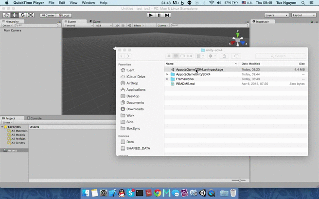
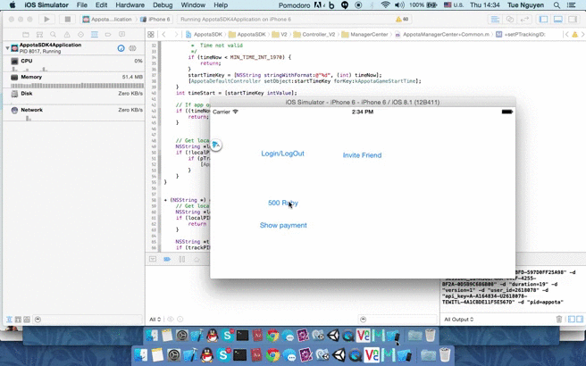

#Appota Game SDK Unity第4版


##重要点

* **Appota 登陆** – 支持Appota, Google, Facebook, Twitter, Guest多种登录方式.
* **Appota 支付** – 支持　SMS, Card, E-Bank, Apple Payment各种支付方式.
* **Appota 分析** – 可收集、可视化及了解用户和用用数据(session, 活动, 错误记录, ...)的大规模服务. 
* **推送通知**

## 概括
1. [集成SDK](#head1-integrate-sdk)
2. [Client API](#head1-client-api)
    * [初始化并且设置SDK](#head2-init-sdk)
    * [用户功能](#head2-user-function)
    * [支付功能](#head2-payment-function)
    * [分析功能](#head2-analytic-function)
    * [推送通知](#head2-push-notification-function)
3. [Class document](#head1-class-document)
4. [FAQ and 说明](#head1-faq)

##1. 集成 SDK <a name = "head1-integrate-sdk"> </a>
[sample apps](Sample/) 是可以为你设置的独立项目。你可以把Unity SDK集成到现有的应用。

###1.1. 先决条件 <a name = "head2-prerequisites">  </a>
开始 Appota Game Unity SDK 你可以设置SDK并且开始建设新项目。 你可以试一试来了解SDK的运行机制。

Required Unity 4.5 or later

###1.2. 取 app api key 和 client key <a name="head2-obtain-app-api-key-and-client-key"> </a>
* 从应用管理页面取得`ClientKey`, `APIKey`, `ClientSecret` 等Appota应用. <a name="head3-appota-appid"> </a> 若你还没向Appota注册Appota应用，你应该[建设新应用](https://developer.appota.com/manage-content.html)  
* 取得 Application ID. <a name="head3-facebook-appid"> </a> [建设、取得及设置IOS的Facebook app info 具体查看](https://developers.facebook.com/docs/ios/getting-started).  
* 取得 Google Client ID 和　Client Secret. <a name="head3-google-appid"> </a> [建设、取得及设置IOS的Google app 具体查看](https://developers.google.com/+/mobile/ios/getting-started)


###1.3. 配置Unity项目 <a name="head2-configure-your-xcode-project"> </a>

####1.3.1. 输入 plugin


####1.3.2. 配置 Unity 项目project

- 用在[集成SDK]建设的`FacebookAppID`, `ApiKey`, `GoogleClientID`, `GoogleClientSecret` has created in [IntegrateSDK](#head1-integrate-sdk)来更新设置


##2. Client API <a name="head1-client-api"> </a>

###2.1 初始化并且设置SDK <a name = "head2-init-sdk"> </a>
相关class 和功能:  
[AppotaSDKHandler](class-document/UnityClasses_cn.html#init-function)  
[AppotaSDKReceiver](class-document/UnityClasses_cn.html#appota-sdk-receiver)    
Appota SDK初始化当应用通过[AppotaSDKHandler](class-document/UnityClasses_cn.html#init-function)调动`AppotaSDKHandler.Instance.Init()`class时要出现，因此大部分时间`AppotaSDKHandler.Instance.Init()`将出现在第一个界面

```
AppotaSDKHandler.Instance.Init();
```

SDK flows的控制功能:

- `SetKeepLoginSession(BOOL)` <a name="set-keep-login-session"> </a> 该功能将控制Appota的登录会话 （Login Session），当开启应用时被保留或者更换（当功能被删除时玩家打开应用后要重新登录）.   
**Note** 如果该功能没有刷出，登录会话将为默认.
- `SetAutoShowLogin(BOOL)` <a name="set-auto-show-login-dialog"> </a> 该功能将控制Appota的登录界面（ Login View）在开启应用时将自动刷出(当用户没有登陆) 或者你要开启[ShowLoginView](#show-login-view)功能.   
**Note** 如果该功能没有刷出, 登录界面（ Login View）在开启应用时将自动刷出(当用户没有登陆)

- 开启`SetSDKButtonVisible(BOOL)`该功能来设置显示或者隐藏SDK 浮动按钮

- 开启`FinishSDK()`该功能在`OnApplicationQuit` 脚本
###2.2. 用户功能<a name="head2-user-function"> </a>
相关class 和功能:

- [AppotaSDKHandler](class-document/UnityClasses_cn.html#user-function)
- [AppotaSDKReceiver](class-document/UnityClasses_cn.html#user-callback)
- [AppotaSession](class-document/UnityClasses_cn.html#appota-session)

当完成SDK初始化时，开启使用登录功能。

####2.2.1. 显示登陆界面（login view） <a name = "head2-show-login-view"> </a>
按上面所提的内容，登陆界面被[SetAutoShowLoginDialog(BOOL)](#set-auto-show-login-dialog)控制.开启应用后登陆界面自动显示或者需要的话可以通过`ShowLoginView`开启:  

- **显示登陆界面**

```
AppotaSDKHandler.Instance.ShowLoginView();

```
<a name="show-login-view"> </a>
Appota 登陆界面含有 **Facebook**, **Google**, **Twitter**, **Appota User** 和 **快速登录**等5个登录方式  


- ** 退出功能 **
 
```
AppotaSDKHandler.Instance.Logout();
```

- ** 更改账号功能 **

用该功能来更改登陆账号.当更改账号成功时记得查看返回(在`OnLoginSucceed`再一次显示)
```
AppotaSDKHandler.Instance.SwitchAccount();
```

- ** 显示玩家信息的功能 **

该功能将刷出玩家信息界面  

```
AppotaSDKHandler.Instance.ShowUserInfo();

```
- ** 查看用户登录 **
该功能返回玩家登录状态

```
AppotaSDKHandler.Instance.IsUserLogin();
```

- ** 取 AppotaSession **
若登录就返回AppotaSession

```
AppotaSDKHandler.Instance.GetAppotaSession();
```

- ** 设置角色**
设置角色功能支持在网站管理角色

```
public void SetCharacter(string name, string server, string characterID)
```
####2.2.2. callbacks验证 <a name = "login-handle-login-response"> </a>

AppotaSDK provide 4 callbacks delegate for login defined in [`AppotaSDKReceiver`](class-document/UnityClasses_cn.html#appota-sdk-receiver) , please implement these functions to handle login result

----
**登录成功调动**  
从`AppotaSession`取得Appota用户后然后通知到服务器来确认并且创造游戏用户。用户在服上集成，具体查看：[User Integration](https://github.com/appota/ios-game-sdk/wiki/Integrate-user-system)  

**Note** 对玩家进行集成之前，要记得在服务器验证Appota UserID, UserName 和 Access token

```
public void  OnLoginSucceed(string appotaSession)

```
|Parameter|Description|  
|-------|-----------|  
|appotaSession|`appotaSession` 是 json 字符串，其包括所有用户信息， 移转字符串到AppotaSession或者容易取得玩家信息(`AppotaSession.Appota_AccessToken`, `AppotaSession.Appota_UserName`) |

----
**登录失败调动**  
调动在登陆发生问题时

```
public void  OnLoginError(string error);

```

----
**退出调动**  
退出之后调动

```
public void  OnLogoutSuccess(string userName)

```

----
**关闭登陆界面调动**  
调动在玩家开启应用后关闭登陆界面时

```
public void  OnCloseLoginView();
```

###2.2. 支付功能 <a name="head2-payment-function"> </a>

相关class 和功能:

- [AppotaSDKHandler - payment function](class-document/UnityClasses_cn.html#payment-function)
- [AppotaSDKReceiver](class-document/UnityClasses_cn.html#payment-callback)
- [AppotaPaymentResult](class-document/UnityClasses_cn.html#appota-payment-result)

要使用 AppotaSDK 支付功能，你要了解Appota支付机制. 请查看Appota支付机制在[Appota Payment Document](https://github.com/appota/ios-game-sdk/wiki/Passive-Confirmation-via-IPN) and payment configuration at [Appota Developer Portal]().

####2.2.1. 显示支付界面<a name="head3-show-payment-view"> </a>

---------
有三个支付界面的显示方式。 每个界面显示一个支付包或者一个支付列表。每种支包含有游戏内金额或者的信息。

** 显示默认支付列表界面 **

可以默认支付包来显示支付界面(配置在[Appota Developer Portal]())

```
AppotaSDKHandler.Instance.showPaymentView()
```


----
** 一包的支付界面 **

按你们游戏内包的机制你可以显示某一种支付界面

```
AppotaGameSDK.Instance.showPaymentViewWithPackageID(string packageID)
```



----
** 从SDK 浮动按钮显示支付界面**  
用户可以从浮动按钮打开支付、信息和交易等界面

(Show image of floating button and then SDK show gif)


####2.2.2 支付调动处理 <a name="head3-handle-payment-callback"> </a>

---------
你要补充并且修改在`AppotaSDKReceiver`里所有的调动.

** 支付成功调动 **

按你的支付机制(IPN, 烦请查看[Appota Payment](https://github.com/appota/ios-game-sdk/wiki/Integrate-payment-system)), 继续验证支付或通知支付成功

```
public void OnPaymentSuccess(string transactionResult);
```

|Parameter|Description|  
|-------|-----------|  
|`transactionResult`|`transactionResult` 是json字符串，其包括所有支付信息 (金额, 游戏货币, package　id), 字符串兑换成 `AppotaPaymentResult`或容易取得支付信息|

----
** Callback for payment state **

** 你要补充该功能以保证充值的正确性 **  
**PAYMENT_STATE** 是必须的，让我们SDK可以正确进行支付操作。按你的支付包。  
比如： packageID: `com.gold.package1` - (在集成过程中确认) 对应于1000元宝档位和Y服的X玩家。支付状态为： com.gold.package1_1000_gold_X_Y (按你的格式).

```
public void GetPaymentState(string packageID);

```
|Parameter|Description|  
|-------|-----------|  
|`packageID`|`packageID` 是被购买的包, `packageID`在支付配置过程中确认|

###2.3. 分析功能 <a name="head2-analytic-function"> </a>

Appota SDK 支持重返界面和活动。 这些信息对宣传和监视运营游戏有好处。

** 监视功能 **  
当进了一个场景将发送视图

```
public void SendView(string name);
```

** 活动监视功能 **  
当用户做一个活动时将发送活动追踪

```
public void SendEvent(string category,string action,string label)
```
确定活动具体的 `category`, `action`, `label` 

###2.3. 推送通知功能 <a name="head3-push-notification-function"> </a>
** 注册群推送通知的功能 **  
注册推送通知 (目前只支持iOS). 使用群名称来选择推送用户群(比如：只推送1服的用户，群名称将为 = "server 1").

```
public void setPushGroup(string groupName)
```

##3. Class Document <a name="head1-class-document"> </a>
- [AppotaSDKHandler](class-document/UnityClasses_cn.html#init-function)
- [AppotaSDKReceiver](class-document/UnityClasses_cn.html#appota-sdk-receiver)
- [AppotaSession](class-document/UnityClasses_cn.html#appota-session)
- [AppotaPaymentResult](class-document/UnityClasses_cn.html#appota-payment-result)

##4. FAQ and Glossary <a name="head1-faq"></a>
- `IPN` 是Appota系统为玩家新增元宝的机制. 具体查看： https://github.com/appota/ios-game-sdk/wiki/Passive-Confirmation-via-IPN
- `PackageID` 每个游戏内的支付包应该附带 package ID (SDKTool提供) 来确认包。
- `PaymentState` 需要与`GetPaymentState`功能补充。 使用`PackageID`和游戏服务器信息来建设 `PaymentState`.   
比如 packageID: `com.gold.package1` - (在集成过程中确认)对应于1000元宝档位和Y服的X玩家。支付状态设为： com.gold.package1_1000_gold_X_Y (按你的格式). 
